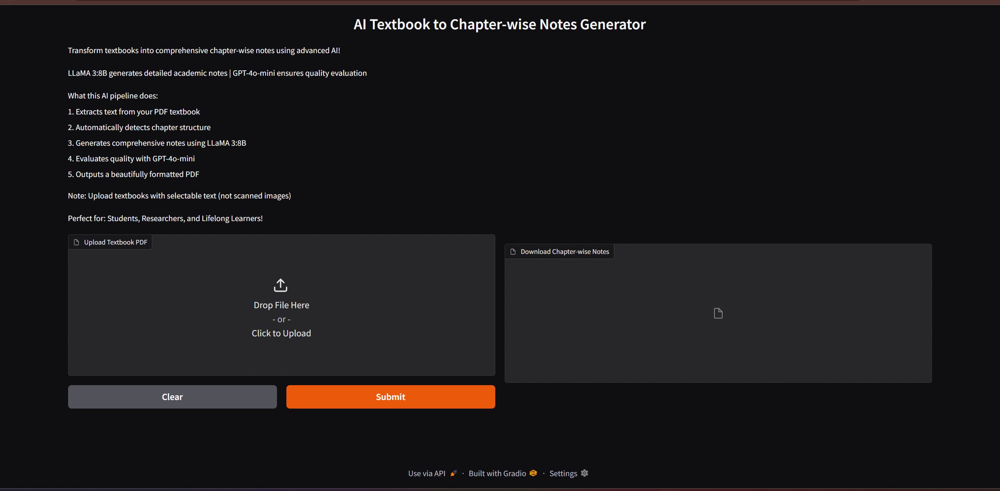

# 🧠 AI Agent: Textbook → Notebook Notes Generator (Chapter-wise)

Convert textbooks (PDFs, DOCX, or text files) into concise, structured academic notebook notes — automatically!

## 📘 Overview

**Textbook → Notebook Notes Generator** is an AI-powered application built in Python (Jupyter Notebook) using **Gradio** and **LLaMA 3:8B** for summarization.  
It processes entire textbooks and produces **chapter-wise study notes**, including:

- Key concepts  
- Formulas and definitions  
- Chapter summaries  
- Structured academic notebook format  

The goal is to help students, educators, and researchers quickly generate high-quality study materials from raw textbooks.


## ⚙️ Features

- ✅ **Multi-format Input:** Supports `.pdf`, `.docx`, and `.txt` textbooks  
- ✅ **Chapter Detection:** Automatically detects and splits chapters using regex-based logic  
- ✅ **Summarization Engine:** Uses **LLaMA 3:8B (via Ollama)** for efficient and context-aware text summarization  
- ✅ **Interactive Gradio Interface:** Upload, generate, and preview notes instantly  
- ✅ **JSON Output:** Stores structured chapter-wise notes in JSON format  
- ✅ **Evaluation Layer (Optional):** Uses a secondary model (ChatGPT/Gemini) to verify and improve quality  
- ✅ **Offline/Local-Friendly:** Works with local LLaMA models — no cloud dependency required  

## 🧩 Project Structure

```
📂 textbook-notes-generator/
│
├── 📘 Textbook_to_Notebook_Notes_Generator.ipynb     # Main Jupyter Notebook
├── 📄 README.md                                       # Project Documentation
├── 📂 data/
│   └── sample.pdf                                    # Example input textbook
├── 📂 outputs/
│   └── notes.pdf                                   # Generated notebook notes
|── .env                                             # To add API keys
└── requirements.txt                                 # Dependencies
```

---

## 🧠 Workflow

1. **Upload File:** Provide a textbook in PDF, DOCX, or text format  
2. **Chapter Extraction:** The system scans for “Chapter” or numbered headings and splits the text  
3. **Summarization:** Each chapter is summarized using the **LLaMA 3:8B** model  
4. **Formatting:** Notes are structured into sections — Overview, Key Terms, and Summary  
5. **Evaluation (Optional):** Notes are refined using a ChatGPT-based evaluator  
6. **Output:** The user receives downloadable JSON notes or can view them directly in Gradio  


## 🚀 Setup & Installation

### 1. Clone the Repository
```bash
git clone https://github.com/your-username/textbook-notes-generator.git
cd textbook-notes-generator
```

### 2. Install Dependencies
```bash
pip install -r requirements.txt
```

**Example `requirements.txt`:**
```txt
gradio
fitz
python-docx
openai
pydantic
dotenv
ollama
```

### 3. Pull LLaMA 3:8B Model
```bash
ollama pull llama3:8b
ollama serve
```

## 🧪 Evaluation (Optional)

You can enable automatic note evaluation using:
- **ChatGPT API** (recommended)
- or any other free API (Gemini, etc.)
- Add your api keys in the .env file 

To disable evaluation, simply comment out the evaluation code block in the notebook.

---

### 4. Run the Notebook
Open `Textbook_to_Notebook_Notes_Generator.ipynb` in Jupyter and run all cells.


## 💻 Gradio Interface

The app launches an interactive web interface:

```
+-------------------------------------------+
| Upload your textbook: [Browse PDF/DOCX]   |
| [Generate Notes]                          |
|-------------------------------------------|
| 📚 Chapter-wise Notes                     |
| 1️⃣ Introduction                          |
| 2️⃣ Methods                               |
| ...                                       |
+-------------------------------------------+
```



## 📦 Output Format (JSON)

**Example:**
```json
{
  "Chapter 1: Introduction": {
    "Overview": "This chapter introduces...",
    "Key Concepts": ["Artificial Intelligence", "Machine Learning"],
    "Summary": "AI is a field that..."
  },
  "Chapter 2: Methods": {
    "Overview": "...",
    "Key Concepts": ["Supervised Learning"],
    "Summary": "..."
  }
}
```

---

## 🧰 Technologies Used

| Category | Tool/Library |
|-----------|--------------|
| Language | Python 3 |
| Interface | Gradio |
| LLM Backend | LLaMA 3:8B (Ollama) |
| File Handling | PyMuPDF, python-docx |
| Evaluation | ChatGPT or Gemini API |
| Data Parsing | Regex, Pydantic, JSON |

---

## 🧑‍💻 Author

**Upendra K.**  
📧 your.email@example.com  
💼 [GitHub Profile](https://github.com/your-username)


